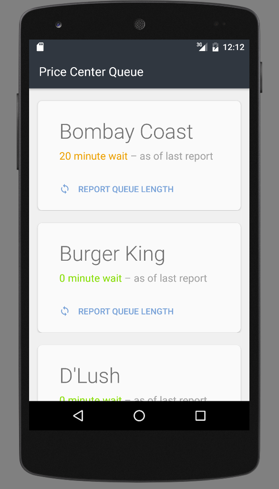

"PC Queue" - A Restaurant Queue Monitor
===============================

# Overview
An Android application that was developed part-time over the course of 7 weeks with a team of 5,
as a series of iterations using the agile methodology and working live with customers, in CSE110 at UC San Diego.

The application can be used to report and view queue times at restaurants (though currently the database only contains information on Price Center, UC San Diego restaurants). It supports multiple concurrent users and offline use, enclosed in a gorgeous user interface that mostly conforms to Android's latest Material Design guidelines.

# Compatibility
The application supports a minimum Android API level 21. It has been tested in the following environments:
- Android emulator running on Mac OSX 10.10.4 Yosemite on Android API level 23 on a Nexus 6 with Google APIs.
- Nexus 6P running Android 6.0 
- HTC device running Android 5.0

# Parse Cloud Setup
This application requires a Parse.com account and database.
- API keys need to be generated and inserted into the Android application (instructions to come).
- A collection within the database named Restaurants needs to be created. A pre-populated collection dump for restaurants at Price Center, University of California at San Diego is included in `parseCloud/Restaurants.json.`

# Screenshots

# Video Demonstration
[Click to view video demo on YouTube](https://www.youtube.com/watch?v=mUBFcjbh5ds&feature=youtu.be)
